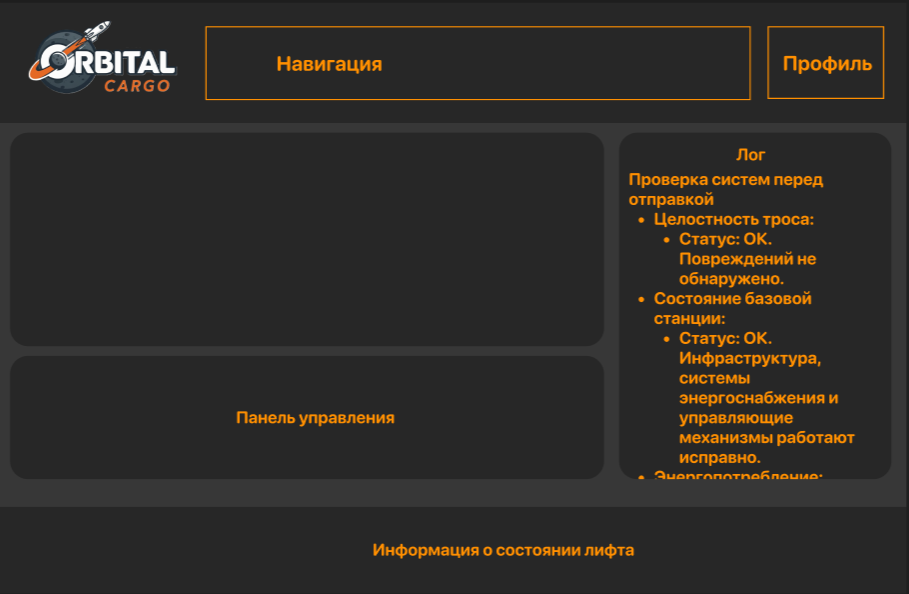
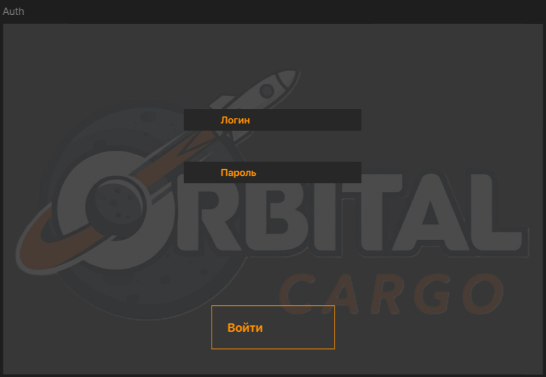
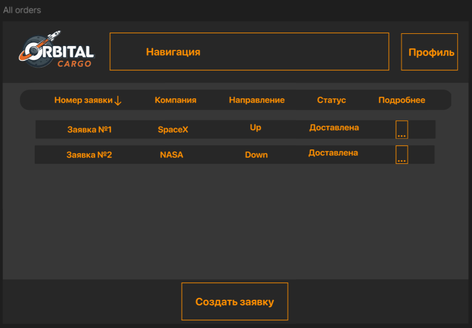
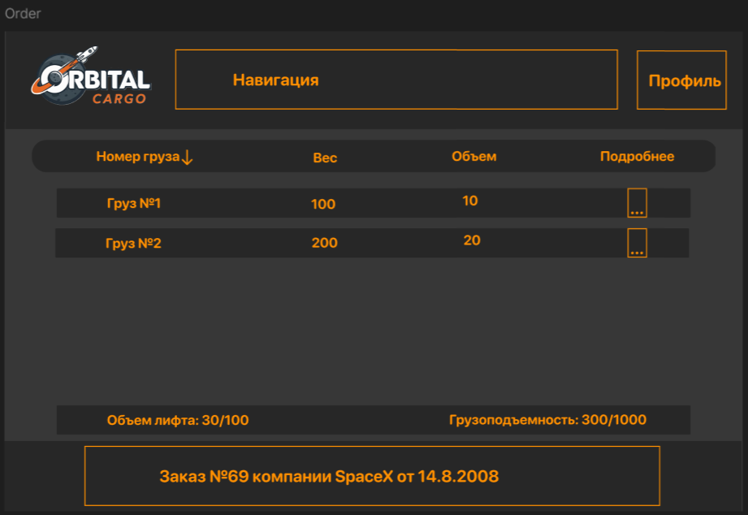
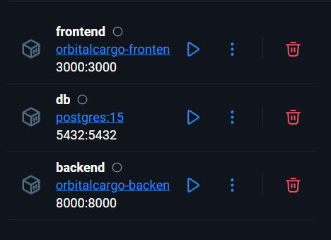
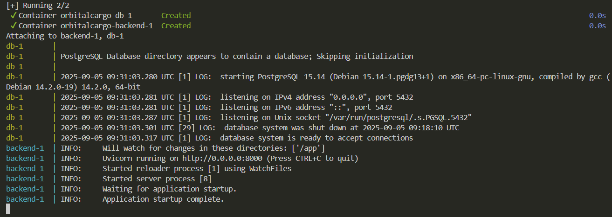
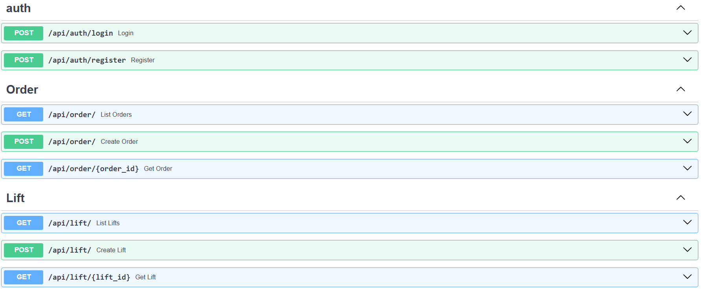

# OrbitalCargo: Система Управления Грузоперевозками
by bad bananas


## Описание проекта

[📄 Презентация проекта (PDF)](docs/project.pdf)


Этот проект представляет собой веб-приложение для симуляции работы предприятия по доставке грузов на орбиту с использованием космического лифта. Система включает модуль управления лифтом и вспомогательные сервисы для взаимодействия администраторов, персонала и клиентов.

**Ключевые особенности:**
- Симуляция управления кабиной лифта (старт, остановка, мониторинг параметров).
- Учет заявок на грузоперевозки и управление складом.
- Ролевая модель доступа: оператор лифта и сотрудник отдела заявок.
- Обновления состояния через веб-интерфейс в прямом эфире.

Проект разработан командой из 5 человек в рамках ограниченного времени (20 часов), с фокусом на MVP (минимально жизнеспособный продукт).

## Стек технологий

| Раздел        | Технологии |
|---------------|------------|
| **Frontend**  |  React <br>  Redux |
| **Backend**   |  Python <br>  FastAPI <br>  Aiogram |
| **База данных** |  PostgreSQL |
| **Деплой**    |  Docker |


## Запуск проекта с помощью Docker

Для запуска всех сервисов используйте Docker Compose. Убедитесь, что у вас установлены [Docker](https://www.docker.com/) и [Docker Compose](https://docs.docker.com/compose/).

1. Откройте терминал в корне проекта (`orbitalcargo`).
2. Выполните команду для запуска всех сервисов:

   ```sh
   docker compose up --build
   ```

3. После запуска:
   - **Frontend** будет доступен по адресу: [http://localhost:3000](http://localhost:3000)
   - **Backend API** будет доступен по адресу: [http://localhost:8000](http://localhost:8000)
   - **PostgreSQL** будет работать внутри контейнера (доступ к данным через backend).

Для остановки и удаления контейнеров выполните:

```sh
docker compose down
```

**Примечание:**  
Перед первым запуском убедитесь, что в файле `.env` указаны необходимые переменные окружения для подключения к базе данных и

## Функционал

### Модуль управления лифтом (Задача 1)
- **Управление кабиной:** Команды старта/остановки с подтверждением для безопасности.
- **Мониторинг параметров:** Реал-тайм отображение положения (высота), скорости, веса груза, состояния дверей (открыты/закрыты).
- **Дополнительные функции:** Аварийный стоп, визуализация траектории (графики), логи событий.

### Вспомогательные сервисы (Задача 2)
- **Центр управления:** Дашборд для администраторов с обзором состояний лифтов.
- **Система учета:** Ввод грузов (ID, вес, клиент), отслеживание статуса (ожидание, в пути, доставлено). Интеграция со складом.
- **Взаимодействие:** API для подачи заявок. Дополнительно: отчеты о логистике, поиск по ID.

### Пользователи и роли
- **Оператор лифта:** Доступ к дашборду мониторинга, отправка грузов. Фокус на безопасности и эффективности.
- **Сотрудник отдела заявок:** Формы для ввода данных, отслеживание. Интеграция с клиентскими запросами.

### User Stories

| № | Роль | User Story | 
|---|------|------------|
| 1 | Оператор лифта | Как оператор лифта, я хочу видеть реал-тайм статус лифта (положение, скорость, вес, двери), чтобы обеспечивать безопасные операции. |
| 2 | Оператор лифта | Как оператор лифта, я хочу запускать/останавливать кабину, чтобы эффективно отправлять грузы. |
| 3 | Оператор лифта | Как оператор лифта, я хочу функцию аварийного стопа, чтобы быстро реагировать на сбои. |
| 4 | Оператор лифта | Как оператор лифта, я хочу симулировать загрузку/разгрузку, чтобы тестировать workflow. |
| 5 | Сотрудник отдела заявок | Как сотрудник отдела заявок, я хочу вводить детали груза (вес, размеры, клиент), чтобы точно регистрировать отправки. |
| 6 | Сотрудник отдела заявок | Как сотрудник отдела заявок, я хочу отслеживать статус отправки, чтобы информировать клиентов. |
| 7 | Сотрудник отдела заявок | Как сотрудник отдела заявок, я хочу назначать грузы на слоты лифта, чтобы оптимизировать расписание. |

## Интерфейс

### Главная страница оператора

### Страница авторизации

### Страница заказов

### Информация о заказе



### Структура Docker-контейнеров

- **Frontend** — React + Redux (пользовательский интерфейс)  
- **Backend** — Python + FastAPI + Aiogram (API и бизнес-логика)  
- **DB** — PostgreSQL (хранение данных)  



### Логи запуска


### Swagger UI


## Безопасность
Выполнено:
- Аутентификация
- Хэширование паролей
- Настройка CORS

В будущем:
- HTTPS
- Минимизация прав БД
- Защита от bruteforce


