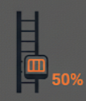
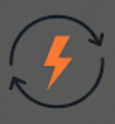

# OrbitalCargo: Система Управления Грузоперевозками


## Описание проекта

Этот проект представляет собой веб-приложение для симуляции работы предприятия по доставке грузов на орбиту с использованием космического лифта. Система включает модуль управления лифтом и вспомогательные сервисы для взаимодействия администраторов, персонала и клиентов.

**Ключевые особенности:**
- Симуляция управления кабиной лифта (старт, остановка, мониторинг параметров).
- Учет заявок на грузоперевозки и управление складом.
- Ролевая модель доступа: оператор лифта и сотрудник отдела заявок.
- Обновления состояния через веб-интерфейс в прямом эфире.

Проект разработан командой из 5 человек в рамках ограниченного времени (20 часов), с фокусом на MVP (минимально жизнеспособный продукт).

## Технологии

- **Frontend:** React (для пользовательского интерфейса, дашбордов и форм).
- **Backend:** FastAPI (для API, обработки запросов и бизнес-логики).
- **База данных:** PostgreSQL (для хранения данных о грузах, заявках и состояниях лифта).

## Запуск проекта с помощью Docker

Для запуска всех сервисов используйте Docker Compose. Убедитесь, что у вас установлены [Docker](https://www.docker.com/) и [Docker Compose](https://docs.docker.com/compose/).

1. Откройте терминал в корне проекта (`orbitalcargo`).
2. Выполните команду для запуска всех сервисов:

   ```sh
   docker compose up --build
   ```

3. После запуска:
   - **Frontend** будет доступен по адресу: [http://localhost:3000](http://localhost:3000)
   - **Backend API** будет доступен по адресу: [http://localhost:8000](http://localhost:8000)
   - **PostgreSQL** будет работать внутри контейнера (доступ к данным через backend).

Для остановки и удаления контейнеров выполните:

```sh
docker compose down
```

**Примечание:**  
Перед первым запуском убедитесь, что в файле `.env` указаны необходимые переменные окружения для подключения к базе данных и

## Функционал

### Модуль управления лифтом (Задача 1)
- **Управление кабиной:** Команды старта/остановки с подтверждением для безопасности.
- **Мониторинг параметров:** Реал-тайм отображение положения (высота), скорости, веса груза, состояния дверей (открыты/закрыты).
- **Дополнительные функции:** Аварийный стоп, визуализация траектории (графики), логи событий.

### Вспомогательные сервисы (Задача 2)
- **Центр управления:** Дашборд для администраторов с обзором состояний лифтов.
- **Система учета:** Ввод грузов (ID, вес, клиент), отслеживание статуса (ожидание, в пути, доставлено). Интеграция со складом.
- **Взаимодействие:** API для подачи заявок. Дополнительно: отчеты о логистике, поиск по ID.

### Пользователи и роли
- **Оператор лифта:** Доступ к дашборду мониторинга, отправка грузов. Фокус на безопасности и эффективности.
- **Сотрудник отдела заявок:** Формы для ввода данных, отслеживание. Интеграция с клиентскими запросами.

### User Stories

| № | Роль | User Story | Acceptance Criteria |
|---|------|------------|----------------------
| 1 | Оператор лифта | Как оператор лифта, я хочу видеть реал-тайм статус лифта (положение, скорость, вес, двери), чтобы обеспечивать безопасные операции. | Данные обновляются каждые 5 сек; дашборд с графиками; алерты при аномалиях. |
| 2 | Оператор лифта | Как оператор лифта, я хочу запускать/останавливать кабину, чтобы эффективно отправлять грузы. | Кнопки с подтверждением; лог событий; симуляция изменения статуса. |
| 3 | Оператор лифта | Как оператор лифта, я хочу функцию аварийного стопа, чтобы быстро реагировать на сбои. | Мгновенная симуляция остановки; уведомление админу. |
| 4 | Сотрудник отдела заявок | Как сотрудник отдела заявок, я хочу вводить детали груза (вес, размеры, клиент), чтобы точно регистрировать отправки. | Форма с валидацией; авто-генерация ID. |
| 5 | Сотрудник отдела заявок | Как сотрудник отдела заявок, я хочу отслеживать статус отправки, чтобы информировать клиентов. | Поиск по ID; лог истории. |
| 6 | Сотрудник отдела заявок | Как сотрудник отдела заявок, я хочу назначать грузы на слоты лифта, чтобы оптимизировать расписание. | Календарь; проверка конфликтов. |
| 7 | Администратор | Как администратор, я хочу центральный дашборд для всех лифтов, чтобы контролировать операции. | Агрегированные метрики; экспорт отчетов. |
| 8 | Оператор лифта | Как оператор лифта, я хочу симулировать загрузку/разгрузку, чтобы тестировать workflow. | Интеграция с виртуальным складом; обновление веса. |
| 9 | Сотрудник отдела заявок | Как сотрудник отдела заявок, я хочу уведомления клиентам, чтобы улучшить сервис. | Email при смене статуса; шаблоны. |

## Интерфейс

Главная страница оператора

Страница авторизации

Страница заказов

Информация о заказе


## Иконки

Состояние базовой станции


Высота кабины



Состояние систем связи


Состояние систем эл. снабжения



Температура кабины


